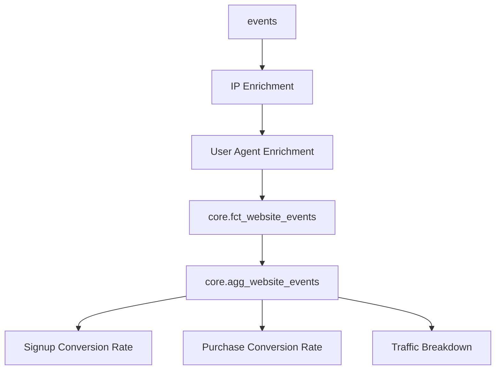

# Data Documentation

## Description

The dataset includes data on the user hits on the websites www.ezcachly.com and www.zachwilson.tech.

The goal of this pipeline is to answer the following questions:

- How many users are going to each website on a daily basis?
    - What is the geographical distribution and device break down of these users?
    - Where are the users coming from? LinkenIn, Google, etc.
- ...

## Business Metrics

| --- | --- | --- |
| Metric Name | Definition | Is Guardrail |
| --- | --- | --- |
| signup_conversion_rate | COUNT(signups) / COUNT(website_hits) | Yes |
| purchase_conversion_rate | COUNT(purchases) / COUNT(signups) | Yes |
| traffic_breakdown | COUNT(website_hits) GROUP BY referrer | No |

## Flow Diagram

## Schemas

### core.fct_website_events

this table is a list of all the events that happen on the website. The unique identifier for this table is the `logged_out_user_id` and `event_timestamp`.

It includes the following columns:

| Column Name | Type | Description |
| --- | --- | --- |
| user_id | BIGINT | This column is nullable for logged out events. It indicated the user who generated the event |
| logged_out_user_id | BIGINT | A hash of the user's IP address and device information |
| dim_hostname | STRING | The hostname of the website that the event happened on |
| dim_country | STRING | The country of the IP address of this request |
| dim_device_brand | STRING | The device of the user who generated the event |
| dim_action_type | STRING | The type of event that happened on the website (signup, watch video, etc,) |
| event_timestamp | TIMESTAMP | The UTC timestamp of the event |
| other_properties | MAP[STRING, STRING] | A map of other properties of the event |

**Quality Checks**

- Not NULL checks on `logged_out_user_id`, `dim_hostname`, `dim_country`, `dim_device_brand`, `dim_action_type`, `event_timestamp`
- No duplicates on primary keys ()`logged_out_user_id` and `event_timestamp`)
- `dim_country` is a valid country
- `dim_action_type` is a valid enumeration

### core.agg_website_events

this table is an aggregated view of all website events.

It includes the following columns:

| Column Name | Type | Description |
| --- | --- | --- |
| dim_action_type | STRING | The type of event that happened on the website (signup, watch video, etc,) |
| dim_country | STRING | The country of the IP address of this request |
| dim_device_brand | STRING | The device of the user who generated the event |
| event_hour | INT | The hour of the event |
| m_total_events | BIGINT | The total number of events that happened |
| aggregation_level | STRING | This is how this aggregation table is grouped. Values include (dim_action_type, dim_country, dim_device_brand) |
| ds | STRING | The date partition for this partition |

**Quality Checks**

- Row count checks
    - (overall) rollup should have more data than any other rollup
- `event_hour` is between 0 and 23